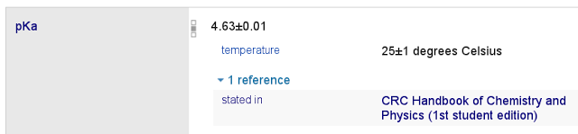

# Wikidata als Universaldatenbank

Als vor 15 Jahren mit dem Versuch begonnen wurde, allein durch die gemeinsamen
Arbeit von Interessierten Laien eine Universalenzyklopädie zu erstellen, war
der Aufstieg von Wikipedia zum zentralen Nachschlagewerk unserer Zeit nicht
absehbar. Trotz regelmäßiger Kritik bezüglich ihrer Verlässlichkeit und
unabhängig von ihrem deskriptiv-narrativen Charakter wird Wikipedia auch dazu
genutzt, einzelne Fakten oder Aussagen wie Geburtsdaten, Größenangaben und
Zugehörigkeiten nachzuschlagen. Solche strukturierten Daten, die unter Anderem
in Listen, Tabellen, Infoboxen und Kategorien zu finden sind, lassen sich
grundsätzlich bessert in Datenbank zusammenführen und auswerten.

Um Daten aus Wikipedia und anderen Wikimedia-Projekten gemeinsam zu verwalten,
wurde deshalb vor 3 Jahren mit [Wikidata](https://www.wikidata.org/) eine
Datenbank geschaffen, die wie Wikipedia direkt von Interessierten bearbeitet
werden kann. Wie in Wikis üblich werden dabei alle Änderungen protokolliert, so
dass prinzipiell keine Informationen verlorengehen. Während Datenbanken
normalerweise auf spezielle Arten von Inhalte und/oder Anwendungen festgelegt
(Geodaten, Adressdaten, Katalogdaten...) handelt es sich bei Wikidata um die
erste "Universaldatenbank": aufgenommen werden kann mindestens alles was für
eines der Wikimedia-Projekte relevant ist wobei die Struktur der Daten (Felder
oder Beziehungstypen...) nicht bis festgelegt ist sondern laufend für neue
Arten von Inhalte erweitert wird.

Zunehmend stammen strukturierte Angaben, für die Wikipedia als
Informationsquelle dient, indirekt aus Wikidata. Wie erfolgreich die
Universaldatenbank letzendlich sein wird, ist allerdings noch offen, zumal es
bislang wenige Versuche von Universaldatenbanken gibt an denen Wikidata
gemessen werden könnte.  (Freebease, Cyc,...?).

Für die Beurteilung und weitere Abschätzung ist es deshalb sinnvoller,
thematische Ausschnitte von Wikidata zu betrachten. Für den Bereich der in von
Bibliotheken verwalteten Daten sind dies vor allem Normdaten und
bibliographische Daten. Die Nutzung von Wikidata als Normdatenquelle wurde
zumindest in Ansätzen bereits an anderer Stelle dargelegt (Voß 2013), der Rest
dieses Artikels behandelt die Verwendung von Wikidata für bibliographische
Daten.

# Wikipedia als Universalbibliographie
 
Im folgenden soll skizziert werden ob und in welcher Form Wikidata als
Universalbibliographie sich eignet. ... dies ist keine ausgearbeitete Untersuchung sondern
eher eine Ideenskizze und Quellensammlung, als Grundlage für weitere Forschungen,
Umsetzungen und nicht zuletzt als Weckruf an alle die sich in irgend einer Weise mit
bibliographischen Daten beschäftigen. 

...

Social Cataloging: erfolgreich, aber: bag model statt set model. Dies ist
verständlich, da nutzer vor allem für sich selber arbeiten. Bei den
Wikimedia-projekten überwiegen jedoch andere Motivationen.
(Note: OpenLibrary)

...

Ist die Idee realistisch?

Sollte zunächst einmal geklärt werden, welche Idee genau. Die Idee einer Universalbibliographie ist vermutlich so alt wie die erste bibliographie überhaupt. Die moderne Universalbibliographie ist 

Nach klärung der Zieles Universalbibliographie wäre zu klären, ob dieses Ziel mit Wikidata erfüllt werden kann oder sogar bereits in Ansätzen erfüllt wird.

Bestandsaufnamen ...

# Exposé

**Der Artikel war ursprünglich als Exposé gedacht. Folgedes muss überarbeitet werden:**

## Forschungsfragen

> Wie eignet sich Wikidata als Universalbibliographie?

I) Grundlagen

    1. Was ist Wikidata?

    2. Was ist eine Universalbibliographie?

II) Bibliographische Daten in Wikidata

    3. In welcher Form können Bibliographische Daten in Wikidata eingetragen werden?

III) Wikidata als Universalbibliographie

    4. Wie kann Wikidata als Bibliographie genutzt werden?

    5. Wie kann Qualität und Abdeckung und sichergestellt werden?

Mehr vergleichbar mit den Ansätzen von Paul Otlet und L.
[@Hartmann2015]
Faktendatenbank

## Stand der Forschung

[@Putman2015]
...

Ein Antrag zu einem EU-Projekt
zur Aufbau einer Virtuelle Forschungsumgebung
[@Wiki4R]
befindet sich derzeit in der Begutachtungsphase.

(including Europeana)

"by the digital humanities research community and the cultural heritage domain."

Beispielanfragen (SPARQL):

* Anzahl der Bücher und literarischen Werke in Wikidata:
  <http://tinyurl.com/LivresCatWD> (fast 500.000)
* Anzahl der Aussagen, die mit einer Quelle mit DOI belegt sind:
  <http://tinyurl.com/zxn8rmb> (über 20.000) 

Benoît Deshayes (User:Shonagon) arbeitet an der Französischen Nationalbibliothek und mit Wikidata.

## Bisherige Ergebnisse

Von verschiedener Seite werden bibliographische Daten in Wikidata eingetragen:

* Zwischen 2010 und 2016 sammelten Egon Willighagen und Samuel Lampa die 
  Säurekonstante ($pK_a$) verschiedener chemischer Substanzen in einer
  Datenbank. Jeder Eintrag besteht aus dem International Chemical Identifier  
  (InChI), einem Messwert und einer Fachpublikation in welcher der Messwert
  publiziert wurde. Die Datenbank wurde inzwischen nach Wikidata übertragen,
  wobei für alle Fachpublikationen einzelne Wikidata-Einträge angelegt wurden.
  [@Willighagen2016]

* ...

* <https://www.wikidata.org/wiki/Wikidata:WikiProject_Books> u.A.

* <http://librarybase.wmflabs.org/wiki/Librarybase:About>

...

## Umsetzung

* Wikidata-Dumps, Wikidata Toolkit
* Für einige Fragestellungen: Vollständige XML-Dumps

Ob ein Mirror notwendig ist? Nein. 

## Mittel und Zeitplan

Die benötigten Sachmittel zur Umsetzung des Forschungsvorhabens sind
überschaubar. Da einige der Untersuchungen recht datenintensiv sind^[Bei
Überarbeitung dieses Exposés in einen Forschungsantrag könnte das Buzzword *big
data* hilfreich sein.] sollte ein leistungsfähiger Entwicklungs-PC angeschafft
werden. Hinzu kommen vor allem Reisekosten für Treffen mit Vertretern der
Wikimedia-Communities und anderen Experten. Ggf. könnten zusätzliche Workshops
im Rahmen anderen Veranstaltung durchgeführt werden. Den größten Anteil der
benötigten Mittel machen also die Personalmittel aus, die wiederum mit Dauer
und Umfang des Vorhabens zusammenhängen.

Bei Beschränkung auf einen Schwerpunkt ließen sich bereits in einem Jahres
ausreichend Ergebnisse erzielen. Für die Behandlung einzelne Teilaspekte,
beispielsweise in Form einer Fachpublikation, reichen möglicherweise bereits
einige Wochen bis Monate tatsächlicher Arbeitszeit. Zur Durchführung des
gesamten Vorhabens in einem Team sollten eher zwei Jahre eingeplant werden.
Sollte das Vorhaben im Rahmen einer Promition durchgeführt werden, so sind drei
bis vier Jahre realistischer. 

*Zu guter Letzt wäre es auch möglich, ganz auf die Umsetzung zu verzichten und
darauf zu vertrauen, dass Wikidata durch Selbstorganisation quasi automatisch
zu irgend einer Form von Universalbibliographie wird.*

Auf einen konkreten Zeitplan wird an dieser Stelle verzichtet, da dieses diesem
Exposé nicht ein konkret geplantes Forschungsprojekt sondern lediglich eine auf
Umsetzung harrende Idee behandelt. 

# Literaturverzeichnis

